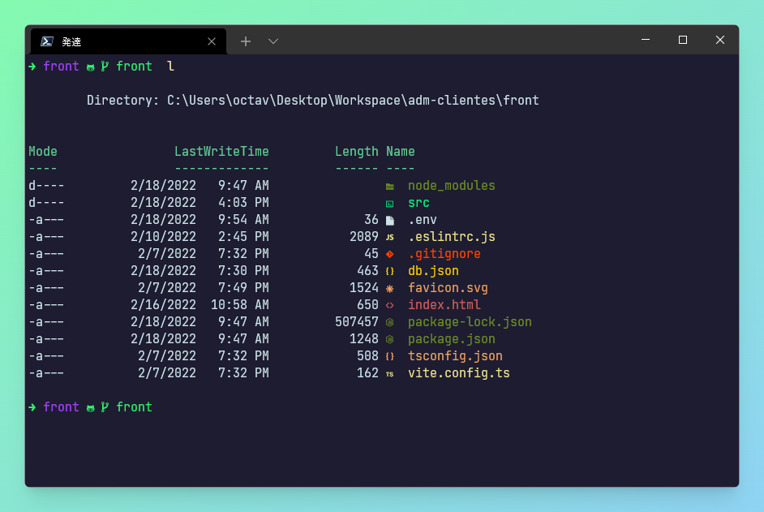
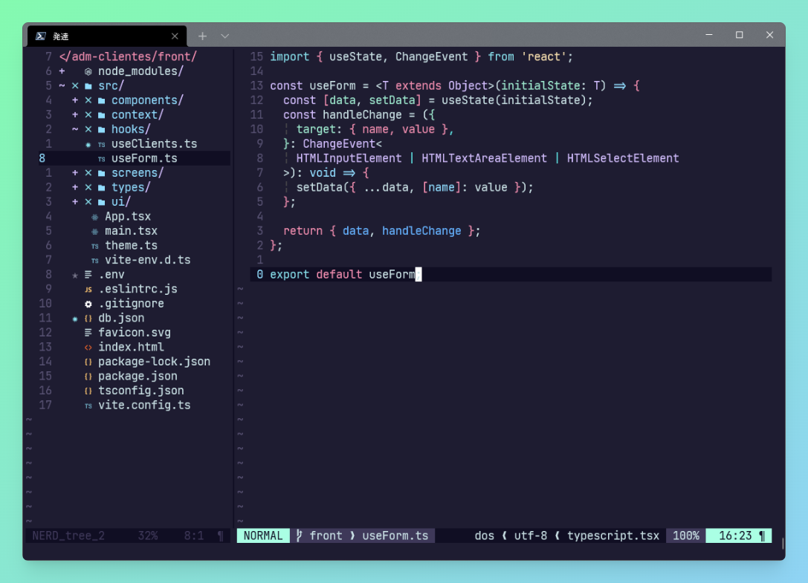

# About my dotfiles ☕️

These dotfiles are likely to change over time. All the config what found in this repository was created in **Windows system**, the files location can be diferent according to a system do you use.

## Neovim Setup

- [vim-fugitive](https://github.com/tpope/vim-fugitive)  
- [Embark theme](https://embark-theme.github.io/)  
- [Polyglot](https://github.com/sheerun/vim-polyglot)  
- [Nerdtree](https://github.com/preservim/nerdtree)  
- [Lightline](https://github.com/itchyny/lightline.vim)  
- [coc-nvim](https://github.com/neoclide/coc.nvim)  
- [Devicons](https://github.com/ryanoasis/vim-devicons)  
- [vim-closetag](https://github.com/alvan/vim-closetag)  
- [Nedtree-syntax-highlight](https://github.com/tiagofumo/vim-nerdtree-syntax-highlight)  
- [nvim-autopairs](https://github.com/windwp/nvim-autopairs)  
- [tmux-navigator](https://github.com/christoomey/vim-tmux-navigator)  
- [identLine](https://github.com/Yggdroot/indentLine)  
- [editorconfig](https://github.com/editorconfig/editorconfig-vim)  
- [easymotion](https://github.com/easymotion/vim-easymotion)  
- [tailwind-intellisense](https://github.com/rodrigore/coc-tailwind-intellisense)  
- [nerdcommenter](https://github.com/preservim/nerdcommenter)  

## Coc Extensions

- [coc-html](https://github.com/neoclide/coc-html)  
- [coc-git](https://github.com/neoclide/coc-git)  
- [coc-eslint](https://github.com/neoclide/coc-eslint)  
- [coc-tsserver](https://github.com/neoclide/coc-tsserver)  
- [coc-css](https://github.com/neoclide/coc-css)  

## Shell Setup

- [Scoop](https://scoop.sh/)  
- [Oh-My-Posh](https://ohmyposh.dev/)  
- [Terminal icons](https://github.com/devblackops/Terminal-Icons)  
- [PSReadLine](https://github.com/PowerShell/PSReadLine)  
- [z](https://www.powershellgallery.com/packages/z/1.1.9)  
